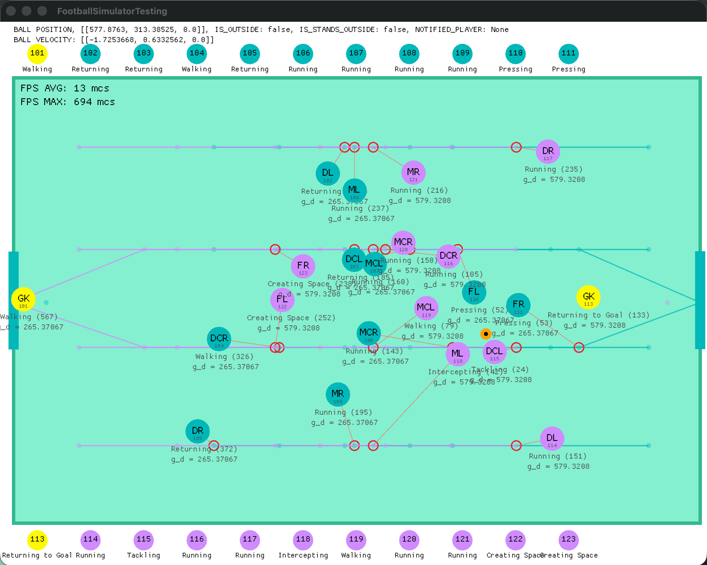

# Open Football

Attempt to implement Sigames Football Manager simulation engine without manual control.

---
**[Live Demo - https://open-football.org](https://open-football.org)**

*The demo simulation is quite resource-intensive, so I disabled the continue button.*

*If you want the full simulation, download and try it locally*

---
The project is a simulation of soccer leagues and clubs, including match simulation.

The project is NOT a game, it is a simulation without the possibility of control.

The goal is to get as close as possible to a real soccer simulation and based on this data:

- Predict match results
- Predict the success of player transfers
  Example: send Kylian Mbappe to Italian Bari and run simulation for 5 years and watch results

What do I need to do?

1) Make a simulation of the match
2) Simulate the rest of soccer activities (training, transfers, etc.)
3) Change the synthetic player database to a real one and run the simulation.
4) Use the simulation

Currently available nation for simulation - **England**

---

#### How to run?

1) Local run

```console
// run frontend (Angular)
cd ui
npm install --force
npm start
...
// run backend
cargo run
...
open chrome at http://localhost:18000
```

2) Run in Docker

```console
cd open-football
docker build -f .\build\Football.Dockerfile -t open-football .
docker run -d -p 18000:18000 --name open-football open-football

open chrome at http://localhost:18000
```

[Match page example (click on any goals)](https://open-football.org/leagues/italian-serie-a)


[Player page example (click on any player)](https://open-football.org/teams/juventus)


[Club page example](https://open-football.org/teams/juventus)


[League page example](https://open-football.org/leagues/italian-serie-a)


#### Project structure

/src/core - Core Rust app logic (including match)

/src/database - Simulation data source logic

/src/dev/graphics - Dev utils for instant match development (src/core/src/match)

Match dev looks like (cross-platform)



/src/dev/neural - Dev utils for training NN for using in match, etc

/src/neural - Core Burn neural network data
/src/server - HTTP server for running API for Angular UI

/ui - Angular app that you can see in **[Live Demo](https://open-football.org)**

---

### License

Apache License 2.0