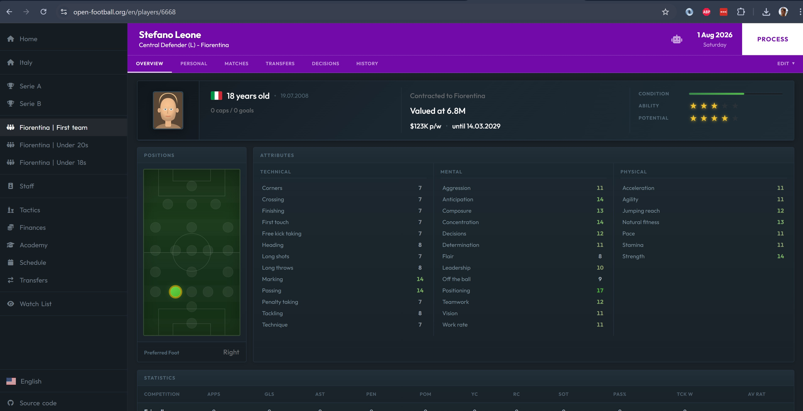
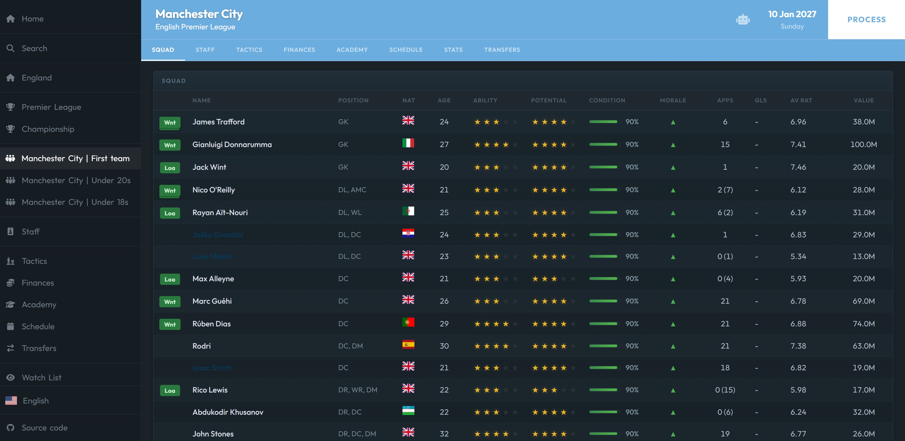
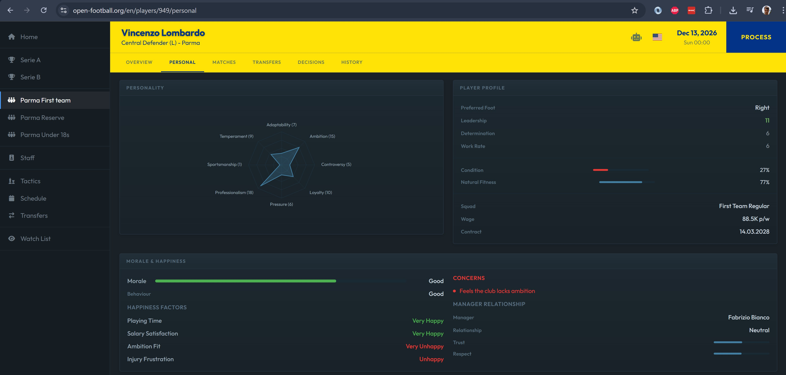
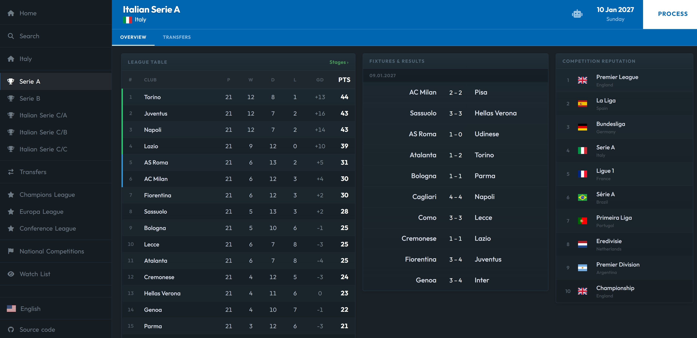
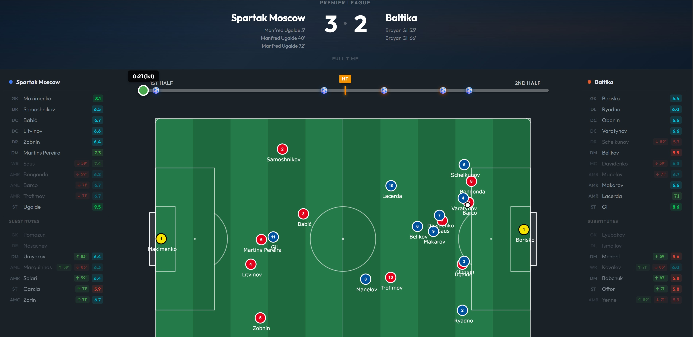
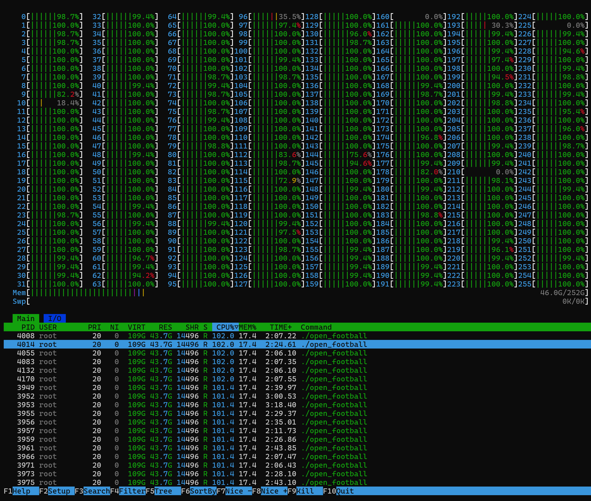

# Open Football

OpenFootball is an ambitious attempt to recreate the depth and realism of the Football Manager simulation engine—without
any manual control.

### **[LIVE DEMO](https://open-football.org)**

#### This is not a traditional game.

OpenFootball is a pure football simulation platform, where matches, careers, and outcomes unfold entirely on their own,
driven by data and logic rather than player input.

### What’s the goal?

To build a highly realistic football simulation capable of:

📊 Predicting match results with data-driven accuracy

🔄 Evaluating and forecasting player transfers and their long-term success

### How it works

OpenFootball is delivered as a single, self-contained binary application.

No setup, no dependencies—just run it and simulate entire football ecosystems, from individual matches to long-term
dynamics across leagues and clubs.

---

## Database & Future Roadmap

OpenFootball is powered by a structured internal database located at /src/database/data/*.*, built using clean and
flexible JSON formats. This database already includes a realistic hierarchy of countries and clubs, along with closely
modeled reputation levels and financial data to ensure an authentic football ecosystem.

At the moment, players are generated dynamically using a randomized system, as a fully detailed real-world player
database (including individual skills and attributes) is not yet integrated.

What’s coming next:

⚽ Real Player Database Integration

Incorporating real player data sourced from Transfermarkt, including detailed attributes and performance metrics.

🔄 Dynamic Shared Database

A centralized, continuously updated database that will automatically sync and download the latest data each time the app
starts.

--- 

[Player page example (click on any player)](https://open-football.org/en/teams/napoli)

[Club page example](https://open-football.org/en/teams/napoli)

[Mobile view example](https://open-football.org/en/leagues/italian-serie-a)

[League page example](https://open-football.org/en/leagues/italian-serie-a)

[Match example (click on any goals)](https://open-football.org/en/leagues/italian-serie-a)

--- 

You can run it locally, just download release and run single binary that contains fully simulation

Be carefully, it can consume all you CPU cores.
Experiment with running it on 256 CPU cores

(Don't worry, it can run on all consumers CPUs)

#### Project structure

/src/core - Core app logic (including match)
/src/database - Simulation data source logic
/src/web - HTTP server for running API with self contained Askama-templates

/.dev/match - Dev utils for must result fast checking and processing duration

### License

Apache License 2.0