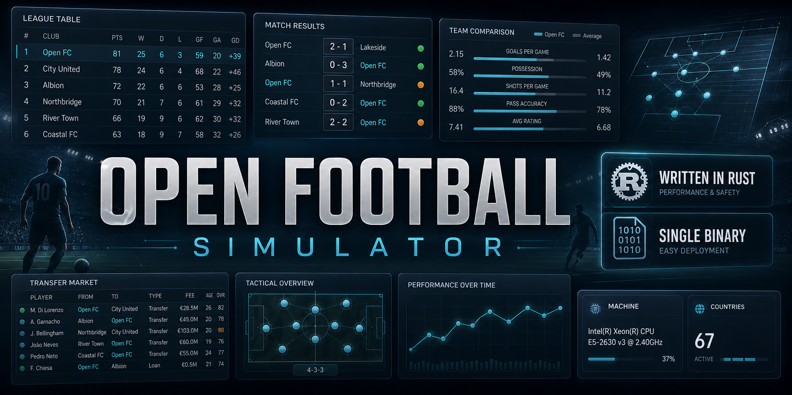
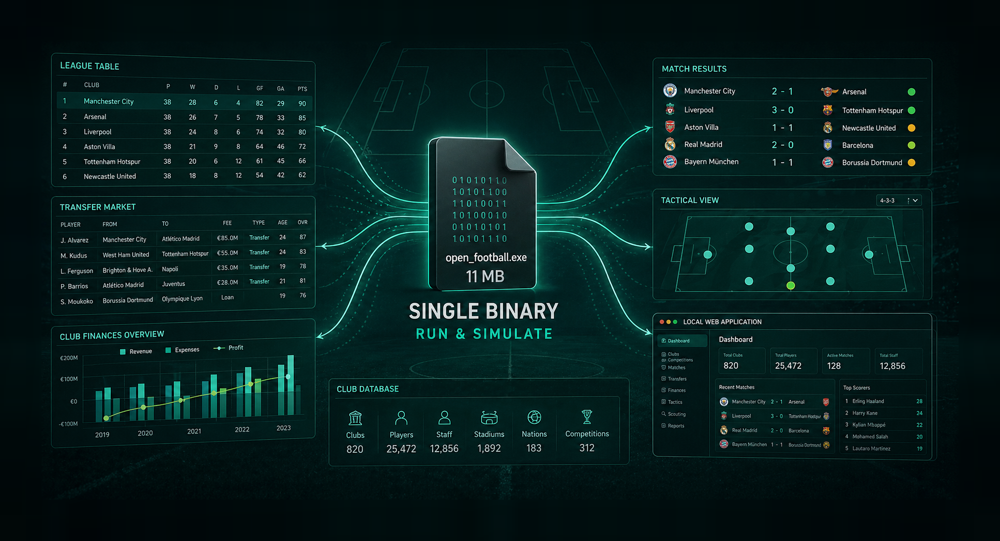

# Open Football

Football world simulator built for people who want to watch the game
evolve by itself.

It simulates clubs, leagues, matches, players, transfers, reputations, finances, and
long-term football dynamics without manual match control.

The goal is not to create another manager game, but to build a realistic simulation engine
where football ecosystems can run, develop, and surprise you on their own.

Tired of Football Manager changing its interface, editor workflow, and database format
every year? 

Open Football is built around a stable structure: the interface and data model
stay familiar while the simulation logic, mechanics, and football intelligence keep
improving.

or download [single binary file](https://github.com/ZOXEXIVO/open-football/releases) to run on your PC / Server

## What Makes It Different

Open Football is focused on simulation first.

- Matches are resolved by the engine, not by user input.
- Clubs and leagues exist inside a connected football ecosystem.
- Transfers, squad building, finances, and reputation all influence long-term outcomes.
- The app is distributed as a single self-contained binary.
- The web interface lets you explore leagues, clubs, players, match details, and simulation results.

The project is designed to answer questions like:

- Which club becomes dominant after several simulated seasons?
- How does a transfer affect a player's career and a club's future?
- Can data-driven match simulation produce believable league tables and results?
- What happens when an entire football world keeps running without intervention?

### Single binary with full-functional simulator

You can run it on your local computer with a
[single binary file](https://github.com/ZOXEXIVO/open-football/releases).

You can run it on your local PC or remote server (and open it with {SERVER_IP}:18000)

## For Football Manager Scouts and Database Editors

Are you a Football Manager scout, researcher, or database editor?

If you are tired of recreating and maintaining custom Football Manager databases for
different game versions, Open Football gives you a more stable simulation base.

Its data model is designed to keep evolving while preserving a consistent structure, so
long-term database work can stay useful instead of being rebuilt every cycle.

You no longer need to get used to a new interface with every version. The interface and
database structure stay stable and familiar; only the simulation logic and football
mechanics continue to change and improve.

## Transfer and Loan Experiments

Open Football also includes an editor-oriented workflow for football experiments.

You can transfer or loan any player to any club, run the simulation, and watch what
happens next.

Try a realistic rebuild, test a wonderkid in a stronger league, or create a strange
scenario like Messi at Wolverhampton and see whether the squad, league, tactics,
finances, and match engine can turn it into success.

## Features

- Autonomous football simulation
- Club, league, and country hierarchy
- Match simulation with detailed match pages
- Player profiles and generated player development
- Club pages with squad and financial context
- League tables and competition views
- Transfer and squad evaluation logic
- Web UI with desktop and mobile layouts
- High CPU scalability for large simulation workloads

## Screenshots

[Player page example](https://open-football.org/en/teams/napoli)

[Club page example](https://open-football.org/en/teams/napoli)

[Mobile view example](https://open-football.org/en/leagues/italian-serie-a)

[League page example](https://open-football.org/en/leagues/italian-serie-a)

[Match example](https://open-football.org/en/leagues/italian-serie-a)

## Running Locally

Download a release build and run the
[single binary](https://github.com/ZOXEXIVO/open-football/releases).

It contains the simulator and the web application.

Open Football can use all available CPU cores during heavy simulations.

It has been tested on machines with very high core counts, including 256 CPU cores, but it
also runs on normal consumer CPUs.

## Database

Open Football uses a structured football database maintained in a separate repository:

**https://github.com/ZOXEXIVO/open-football-database**

If you want to improve club data, player details, league structures, country data, or add
new leagues, please open a pull request in the database repository.

Keeping the data separate makes it easier to update the football world without changing
the simulator code.

The simulator currently combines real structured data with generated player data where
detailed real-world attributes are not available yet.

The long-term goal is to keep expanding the database with better coverage, richer player
information, and more leagues.

## Project Structure

- `src/core` - core simulation logic, including match simulation
- `src/database` - data loading and generation logic
- `src/web` - HTTP server, API routes, and Askama templates
- `.dev/match` - development utilities for fast match-result checks and duration profiling

## License

Apache License 2.0
